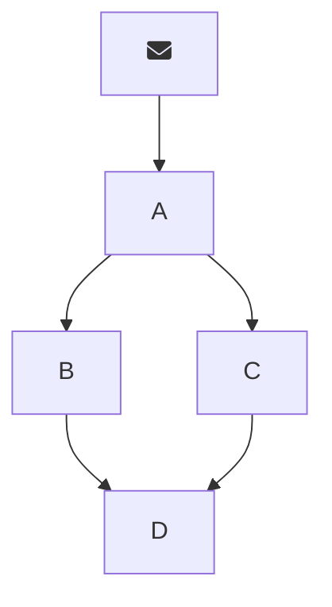

# VirtualDom-Scratch

## Setting

```
$ npm i -y

$ npm i -D parcel
```

---

## Mermaid of Markdown Example

<i class="far fa-envelope"></i>


```mermaid
graph TD;
    fa:fa-envelope-->A;
    A-->B;
    A-->C;
    B-->D;
    C-->D;
```


```mermaid
graph LR
    fa:fa-check-->fa:fa-coffee
```
